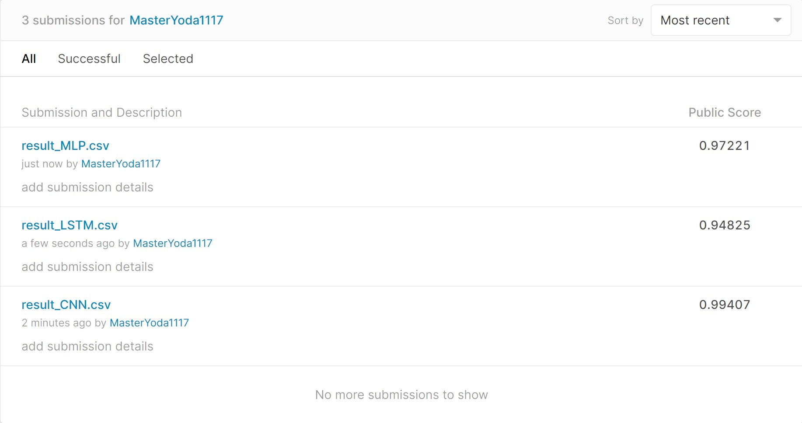

# Digit Recognition

## 运行

`python main.py`

* 依赖库：
  * TensorFlow
  * pandas
  * numpy

## 简介

本项目使用基于TensorFlow后端的Keras API，搭建了CNN、LSTM、MLP三种深度模型，利用Kaggle平台的digital-recognizer项目提供的训练集对模型进行训练，实现了对手写数字的识别。程序的主要部分包括模型构建、训练、预测三部分，均包装在三个对应的模型类中。项目最终提交的最好成绩为CNN模型的99.285%。

## 模型结构

* **CNN模型**

  本项目所搭建的CNN模型为基于`LeNet-5`CNN模型改造而来，增加了层级，处理了过拟合问题，同时进行了细粒度的参数调整，具体结构如下：

  

  本模型对`LeNet-5`的主要改进包括对每一个Convolution层进行了扩展，由一层增加为两层，提高模型的深度，同时，在其后增加了Dropout层，以处理在训练中遇到的过拟合问题，训练集的准确率达到了99.78%，但是验证集准确率为95.67%。

  此外，还根据实际的训练情况对于训练参数，包括学习率、迭代次数等进行了多次调整。在初始实验中，学习率为$e^{-5}$，迭代次数为3000，但是很快发现训练模型发生了过拟合问题，对于测试集准确率相当低，于是配合实际情况调整了学习率和迭代次数为0.001和40，测试准确率也出现了较大的提升，达到了97.957%。

  进一步，观察验证集准确率发现后期准确率不再提升，初步考虑是学习率过高导致的问题，于是加入了学习率的动态调整，当验证集准确率多次保持相近时，将学习率减半，最终准确率提高至了99.285%。

* **LSTM**

  

  此LSTM模型设计较为简单，仅由三层构成，分别是LSTM、Dense和Activation。最终测试准确率在93%~95%左右。

* **MLP**

  

  MLP模型则由三个Dense层和中间的Dropout层构成，主要用于处理过拟合的问题，在实验测试中，某次训练的准确率停留在了40%左右，原因不明，其它实验测试中MLP的准确率均在97.8%左右。

## 实验结果

## 模型分析

本实验中的三种模型，从最终的测试结论来看，CNN模型的表现最好，MLP其次，LSTM最后。对造成这一现象的原因分析如下：

* **模型复杂度**

  首先在于模型的复杂度，可以看出CNN、MLP和LSTM的设计复杂度是递减的，这对准确率造成了一定的影响。从设计上来看，LSTM的层数过低，导致其准确率不高。

* **图形处理适应度**

  从模型本身来看，CNN模型对于图形处理有着良好的支持，也符合图像的三维结构（长、宽、色彩），而MLP和LSTM对于图形的特点没有很好的把握，特别是LSTM对于序列化数据的适应性使其在图像处理上相较CNN劣势更大。

## 问题思考

* 实验训练什么时候停止是最合适的？简要陈述你的实现方式，并试分析固定迭代次数与通过验证集调整等方法的优缺点。

  训练应该在准确率保持一定时间不再提升时停止。本项目中的实现方式为固定迭代次数，但会通过验证集调整学习率，通过降低学习率进一步提高准确率，同时避免过拟合的问题。

* 实验参数的初始化是怎么做的？不同的方法适合哪些地方？（现有的初始化方法为零均值初始化，高斯分布初始化，正交初始化等） 

  实验参数的初始化采用了零均值初始化。

*  过拟合是深度学习常见的问题，有什么方法可以方式训练过程陷入过拟合。 

  避免训练迭代次数过多、降低学习率、降低网络深度、添加Dropout层。

*  试分析 CNN（卷积神经网络）相对于全连接神经网络的优点

  CNN能够结合图像的平面二维特征，逐块分析图像信息，从而给出一个图像的整体特征描述，而全连接网络只能将图片作为一维数组，丢失了许多图片的特征信息。